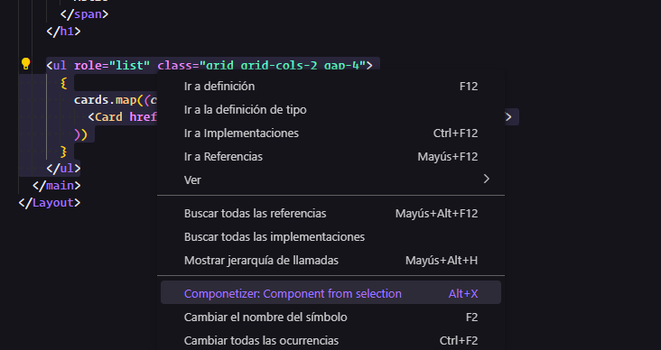

# Componetizer: Components from selection

Crear componentes es importante para mantener tu codigo limpio, ordenado y escalable. Cuando estas desarollando, por prisa o por falta de tiempo, se deja para despues la componetizacion de algunos elemenos. Con **Componetizer** ya no hay excusa, selecciona el fragmento de codigo, y voila, **Componetizer** se encargara de crear el componente en la carpeta correspondiente, asi como de añadir el import y substituir la seleccion por el componente.

## Functionality

A continuacion se muestra una lista con el funcionamiento de la extension:

1. Selecciona un fragmento de codigo.
2. Desde el menu contextual selecciona `Componetizer:...` o usa el atajo de teclado `Alt+X`.
3. Añade el nombre al nuevo archivo (ej. `MyComponent.jsx`).
4. Automaticamente se buscara la carpeta `components` en tu proyecto.
5. Si esta no existe se creara automaticamente dentro de la carperta `src` (en pryectos de `Svelte`, esta se creara en `src/lib/`)
6. Se creara dentro de la carpeta `components` el nuevo componente.
7. El texto seleccionado se substiuira por el componente
8. La importacion del componente se realizara automaticamente.

## Requirements

Esta extension esta orientada para proyectos de `React`, `Next.js` `Svelte`, `Sveltekit`, `Astro`, etc.

## Known Issues

Es posible que en algunos casos, si la carpeta components no esta creada, esta se genere en una ruta no compatible con tu proyecto.

Dado que se pueden dar casos donde se utilicen a la vez extensiones `.jsx` y `tsx`, o en proyectos de `Astro`, multiples extensiones, no se ha implementado la auto deteccion de extension.

## Release Notes

### 1.0.0

Coming soon...

### 0.0.1

Created all extension base logic and project.

---
